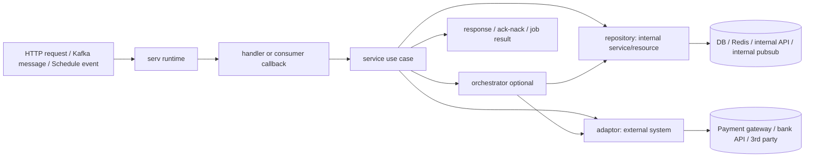

# BE Design Pattern

---

## Prerequisite

- `github.com/witwoywhy/go-cores v1.0.2`

---

## Base Principles

- **Clean Architecture**: outer layers call inward. Runtime and handler call service; service owns the use case; infrastructure/framework code does not own business flow.
- **Hexagonal Architecture**: service talks to dependencies through ports. `repository/` handles internal services/resources inside our project/network; `adaptor/` handles external systems outside our network/control.
- **Single Responsibility**: each package has one role: runtime starts, handler binds, service coordinates, orchestrator reuses rules, adaptor/repository integrates tools.
- **Dependency Injection**: concrete dependencies are built at the edge (`handler.Bind...`, `consumer.Run`) and passed through `New(...)`.
- **DDD-lite**: `domain/` and `enum/` hold the shared business language, models, statuses, and business error codes. This is not full DDD aggregate/event modeling.
- **Black-box Unit Test**: test public `Execute(...)` behavior with mocked dependencies; assert response/error, not private implementation.

---

## Package Layout

```
main.go                     → init() loads Viper, main() selects runtime entrypoint
│
├── infrastructure/         → Singleton init globals, depends on service needs
│   ├── app.go              →   App metadata
│   ├── log.go              →   Structured logger
│   ├── circuit-breaker.go  →   Circuit breaker config
│   ├── validate.go         →   Validator + enum validation
│   ├── db.go               →   DB singleton when service uses DB
│   └── shutdown.go         →   Graceful teardown
│
├── httpserv/               → HTTP runtime entrypoint — use when service is HTTP
│   └── run.go              →   HTTP app, middleware, route binding, listen/serve
│
├── consumer/               → Consumer runtime entrypoint — use when service consumes messages
├── scheduler/              → Scheduler runtime entrypoint — wait to learn
│
├── library/                → Custom helper library
│   │                       → Rule: do NOT import packages from /internal
│   └── uuids/              →   UUID generator with mock hook
│
└── internal/               → Application core
    ├── domain/             → Business models, ORM models when needed, domain errors
    ├── enum/               → Enums separated by package name
    ├── handler/            → HTTP handler func + bind router func
    ├── service/            → Use cases
    ├── orchestrator/       → Reusable use case logic, prevents import cycle on service
    ├── adaptor/            → Port + adapter for external systems outside our network/control
    └── repository/         → Port + adapter for internal services/resources inside our project/network
```

### Simple Data Flow



### Main entry point

```go
func init() {
    vipers.Init()           // REQUIRED — config must load first, before anything else
}

func main() {
    infrastructure.InitApp()
    infrastructure.InitLog()
    infrastructure.InitCircuitBreaker()
    infrastructure.InitValidate()
    infrastructure.InitDB()
    httpserv.Run()          // runtime entrypoint selected by service type
}
```

**Rule**: `init()` is the hard requirement (`vipers.Init()` loads config). Everything in `main()` is situational — initialize only what the service actually needs, then call the runtime entrypoint.

---

## `infrastructure` — Singleton Initialization

`infrastructure/` owns process-level singletons and initialization helpers. These functions are called from `main()` before the runtime entrypoint starts.

**Key property**: Infrastructure packages initialize shared runtime dependencies. They should not contain business use case logic.

### Package structure

```
infrastructure/
  app.go              → apps.Init()
  log.go              → logs.Init(...)
  circuit-breaker.go  → circuitbreaker.Init()
  validate.go         → validator singleton + enum validators
  db.go               → DB singleton when the service uses DB
  shutdown.go         → Cleanup for DB/logs/etc.
```

### Init pattern

```go
func main() {
    infrastructure.InitApp()
    infrastructure.InitLog()
    infrastructure.InitCircuitBreaker()
    infrastructure.InitValidate()
    infrastructure.InitDB()
    httpserv.Run()
}
```

**Key points:**
- Initialize only the infrastructure the service needs
- `InitValidate()` registers enum validators used by service request validation
- `InitDB()` creates `infrastructure.DB` for repository constructors
- `Shutdown()` is passed to runtime entrypoints for graceful teardown

---

## `serv` — Runtime Entrypoints

Runtime packages start the process for a specific service type. Use exactly one runtime entrypoint at the end of `main()`.

### Entrypoint

`main.go` initializes only the infrastructure required by the service, then calls one runtime entrypoint.

**Infrastructure init rule**:
- Always initialize `App`
- Always initialize `Log`
- Initialize other infrastructure only when required by the use case
- Call exactly one runtime entrypoint last

Use-case infrastructure examples:
```go
infrastructure.InitCircuitBreaker() // if using circuit breaker / external calls
infrastructure.InitValidate()       // if using validator tags or infrastructure.Validate
infrastructure.InitDB()             // if using repository with DB
```

HTTP service:
```go
func main() {
    infrastructure.InitApp()
    infrastructure.InitLog()
    infrastructure.InitCircuitBreaker()
    infrastructure.InitValidate()
    infrastructure.InitDB()
    httpserv.Run()
}
```

Consumer service:
```go
func main() {
    infrastructure.InitApp()
    infrastructure.InitLog()
    consumer.Run()
}
```

Consumer service with DB:
```go
func main() {
    infrastructure.InitApp()
    infrastructure.InitLog()
    infrastructure.InitDB()
    consumer.Run()
}
```

**Rule**: Pick one runtime entrypoint:
- `httpserv.Run()` for HTTP service
- `consumer.Run()` for Kafka/message consumer
- `scheduler.Run()` for scheduler service

### `httpserv` — HTTP Server Bootstrap

`httpserv/` owns HTTP server startup. It creates the Gin app from `go-cores/gins`, registers middleware, binds handlers, and starts the server with graceful shutdown.

**Key property**: `httpserv.Run()` is infrastructure wiring for HTTP. It should not know business logic or construct service dependencies directly; that belongs in `handler.Bind<Action>Route`.

#### Package structure

```
httpserv/
  run.go       → Create app, middleware, route binding, listen and serve
```

#### `run.go`

```go
package httpserv

import (
    "transfer-service/infrastructure"
    "transfer-service/internal/handler"

    "github.com/gin-contrib/gzip"
    "github.com/witwoywhy/go-cores/gins"
)

func Run() {
    app := gins.New()

    app.UseMiddleware(gzip.Gzip(gzip.DefaultCompression))
    app.UseMiddleware(app.Log())
    app.UseMiddleware(app.Error())

    handler.BindVerifyRoute(app)
    handler.BindPerformRoute(app)

    app.ListenAndServe(infrastructure.Shutdown)
}
```

**Key points:**
- `gins.New()` creates the HTTP app from `go-cores`
- Register middleware before binding routes
- Common middleware: gzip, request log, centralized error handler
- Bind routes by calling `handler.Bind<Action>Route(app)`
- Keep route-specific dependency construction inside handler bind functions
- `app.ListenAndServe(infrastructure.Shutdown)` starts the HTTP server and connects graceful shutdown

#### Main usage

`main.go` calls `httpserv.Run()` after required infrastructure has been initialized.

```go
func main() {
    infrastructure.InitApp()
    infrastructure.InitLog()
    infrastructure.InitCircuitBreaker()
    infrastructure.InitValidate()
    infrastructure.InitDB()
    httpserv.Run()
}
```

**Rule**: `httpserv.Run()` is only used when the service exposes HTTP. For consumer, scheduler, or worker services, the final call in `main()` should be that service's runtime entrypoint instead.

### `consumer` — Kafka Consumer Runtime

`consumer/` owns Kafka consumer startup. It creates the consumer group, receives messages, unmarshals message payload, creates a message logger, calls the service, and returns ack/nack.

**Key property**: Consumer runtime replaces `httpserv.Run()` for message-driven services. It does not use `handler/` or HTTP `RouteContext`.

#### Package structure

```
consumer/
  run.go       → Create service, consumer group, message callback, consume loop
```

Consumer service usually has a processor use case:
```
internal/service/
  processor/
    domain.go
    service.go
```

#### Config

Consumer group configuration comes from `config.yaml`.

```yaml
pubsub:
  log:
    broker:
    topic: log
    cert:
      type: file
      cert:
      key:
      ca:
```

Use the config key when creating the consumer:
```go
kafka.AddConfigKey("pubsub.log")
```

#### `run.go`

```go
package consumer

import (
    "context"
    "encoding/json"
    "log-consumer/internal/service/processor"

    "github.com/witwoywhy/go-cores/apps"
    "github.com/witwoywhy/go-cores/kafka"
    "github.com/witwoywhy/go-cores/logs"
)

func Run() {
    service := processor.New()

    consumer := kafka.NewConsumerGroup(
        kafka.AddConfigKey("pubsub.log"),
        kafka.AddLogger(logs.L),
    )

    consumer.Consume(logs.L, func(ctx context.Context, topic, group, key string, value []byte) bool {
        var request processor.Request
        err := json.Unmarshal(value, &request)
        if err != nil {
            logs.L.Errorf("failed when json.Unmarshal(value, &request): %v", err)
            return false
        }

        l := logs.New(map[string]any{
            apps.TraceID: request[apps.TraceID],
            apps.SpanID:  request[apps.SpanID],
        })

        service.Execute(&request, l)

        return true
    }, func() {})
}
```

**Key points:**
- Create the service before starting the consume loop
- `kafka.NewConsumerGroup(...)` reads broker/topic/cert from config
- Callback receives raw message bytes in `value`
- `json.Unmarshal(...)` failure returns `false` to nack / not acknowledge
- Build a new logger from message trace/span IDs so logs continue the event trace
- Call service with message request and logger
- Return `true` when the message is handled and can be acknowledged
- Cleanup function is the third argument to `Consume(...)`

#### Consumer service

Consumer service can use the same service package pattern as HTTP services:

```
internal/service/<action>/
  domain.go       → Service interface + Request/Response
  service.go      → Implementation
  service_test.go → Unit test when needed
```

For non-HTTP services, the signature can be reduced because there is no HTTP route context.

```go
type Service interface {
    Execute(request *Request, l logger.Logger) (*Response, errs.Error)
}
```

Example:
```go
package processor

import (
    "github.com/witwoywhy/go-cores/errs"
    "github.com/witwoywhy/go-cores/logger"
)

type Service interface {
    Execute(request *Request, l logger.Logger) (*Response, errs.Error)
}

type Request = map[string]any

type Response struct{}
```

Implementation:
```go
type service struct{}

func New() Service {
    return &service{}
}

func (s *service) Execute(request *Request, l logger.Logger) (*Response, errs.Error) {
    return &Response{}, nil
}
```

**Key points:**
- Service signature depends on runtime context, not only service type
- HTTP can use `Execute(request, logger)` when route is registered with `app.WithLogger(...)`
- HTTP uses `Execute(request, rctx, logger)` only when route is registered with `app.WithRouteContext(...)` and the use case needs `RouteContext`
- Consumer service normally uses `Execute(request, logger)` because there is no HTTP route context
- Other service rules stay the same: constructor injection, `domain.go`, `service.go`, unit tests, and business logic inside service
- Keep the consume callback thin: unmarshal → logger → service → ack/nack

### `scheduler` — Wait to learn

Scheduler service pattern is not documented yet. Learn from a real scheduler service before writing this section.

---

## `library` — Custom Helpers

`library/` contains reusable helper packages owned by the service.

**Key property**: `library/` can be imported by application packages, but it must not import from `internal/`.

### Package structure

```
library/
  <helper>/       → Small reusable helper package
```

**Example**:
```go
library/uuids/
  uuid.go        → UUID generator with mock hook for tests
```

**Rule**: Keep library helpers generic. If the helper needs domain/service knowledge, it belongs under `internal/` instead.

---

## `internal` — Application Core

`internal/` contains the application core: data shapes, HTTP handlers, business use cases, reusable orchestration, and ports/adapters.

### `domain` — Shared Data Shapes

`domain/` stores shared business data structures and domain error codes. `enum/` stores typed enum values, validation hooks, and optional maps for display or lookup.

**Key property**: Domain and enum packages are shared by service, orchestrator, adaptor, and repository layers. They should stay independent from application flow and should not import service, handler, adaptor, repository, or orchestrator packages.

#### Package structure

```
internal/domain/
  error.go                         → Domain error code constants
  <entity>.go                      → Domain model / ORM model

internal/enum/
  <enum-name>/
    <name>.go                      → Type, constants, validation, optional maps
```

**Rule**: Split enum packages by enum name. Import with explicit aliases when needed, e.g. `transactionstatus` and `transfertype`.

---

#### Domain model

Domain models are shared data structures. Default to one model with normal Go types, `gorm` tags, and `TableName()`. Split into a second `ORM` model only when persistence needs DB-specific types that should not leak into normal business use.

**Naming convention**:
- Default model: `<Entity>` — e.g. `TransferTransaction`
- Special ORM model: `<Entity>ORM` — e.g. `TransferTransactionORM`
- Default file: `<entity>.go`
- Split file only when needed: `<entity>.go` and `<entity>-orm.go`

```go
package domain

import (
    transactionstatus "transfer-service/internal/enum/transaction-status"
    transfertype "transfer-service/internal/enum/transfer-type"
)

// Default: one model works for both normal use and ORM.
type TransferTransaction struct {
    Id               string                   `gorm:"column:id"`
    TransactionRefId string                   `gorm:"column:transaction_ref_id"`
    Type             transfertype.Type        `gorm:"column:type"`
    FromAccount      string                   `gorm:"column:from_account"`
    ToAccount        string                   `gorm:"column:to_account"`
    Amount           float64                  `gorm:"column:amount"`
    Status           transactionstatus.Status `gorm:"column:status"`
    TransactionTime  *string                  `gorm:"column:transaction_time"`
}

func (t TransferTransaction) TableName() string {
    return "transfer_transactions"
}
```

Split only when ORM needs a DB-specific type:
```go
package domain

import (
    "github.com/lib/pq"
)

// Normal purpose model — stays clean for business use.
type TransferTransaction struct {
    Id   string
    Tags []string
}

// ORM model — only for persistence-specific shape.
type TransferTransactionORM struct {
    Id   string         `gorm:"column:id"`
    Tags pq.StringArray `gorm:"column:tags;type:text[]"`
}

func (t TransferTransactionORM) TableName() string {
    return "transfer_transactions"
}
```

**Key points:**
- Use domain models when data represents a business entity shared across packages
- Default to one model with `gorm` tags when normal Go types work for both business and ORM use
- Use `ORM` suffix only when persistence needs DB-specific types, e.g. normal model uses `[]string` but PostgreSQL ORM model uses `pq.StringArray`
- Domain models can reference enum types, but should not call services or infrastructure
- Repository ports can reuse domain or ORM models with type aliases when the shape matches exactly

```go
type Request = domain.TransferTransaction
type Response struct{}
```

---

#### Domain errors

Domain errors are constants that represent business error codes.

```go
package domain

const (
    Err030001 = "030001"
    Err030002 = "030002"
    Err030003 = "030003"
    Err030004 = "030004" // verify transaction not found
    Err030005 = "030005" // cbs transfer failed
)
```

**Usage**:
```go
if cbsAccount.IsMule {
    return nil, errs.NewBusinessError(domain.Err030002)
}

if request.Amount > cbsAccount.Balance {
    return nil, errs.NewBusinessError(domain.Err030003)
}
```

**Key points:**
- Put business error code constants in `domain/error.go`
- Use `errs.NewBusinessError(domain.ErrXXXXX)` for expected business failures
- Raw adaptor/DB errors should be mapped before leaving adaptor/repository
- Add comments when the code is not obvious from nearby usage

---

### `enum` — Typed Constants and Lookup

Enum packages define a named type, constants, and optional validator function.

```go
package transactionstatus

import (
    "github.com/go-playground/validator/v10"
)

type Status string

const (
    Verify     Status = "VERIFY"
    Processing Status = "PROCESSING"
    Success    Status = "SUCCESS"
    Fail       Status = "FAIL"
)

func Validate(fl validator.FieldLevel) bool {
    switch Status(fl.Field().String()) {
    case Verify, Processing, Success, Fail:
        return true
    default:
        return false
    }
}
```

Register enum validation in infrastructure:
```go
func InitValidate() {
    Validate = validator.New()

    Validate.RegisterValidation("transferType", transfertype.Validate)
    Validate.RegisterValidation("transactionStatus", transactionstatus.Validate)
}
```

Use validation tags in request DTOs:
```go
type Request struct {
    TransactionId string `json:"transaction_id" validate:"required"`
    Status        transactionstatus.Status `json:"status" validate:"transactionStatus"`
}
```

**Key points:**
- Enum package name should be specific, e.g. `transaction-status` directory with `transactionstatus` package
- Export the enum type (`Status`, `Type`) and constants (`Verify`, `Interbank`)
- `Validate()` lets `infrastructure.Validate.Struct(...)` enforce allowed values
- Custom validation can also use a lookup map when not using struct tags

---

#### Enum maps

Use maps when the enum needs lookup behavior, display text, or manual validation.

```go
package transfertype

import (
    "github.com/witwoywhy/go-cores/enum/language"
)

type Type string

const (
    Intrabank Type = "INTRABANK"
    Interbank Type = "INTERBANK"
)

var Map = map[Type]map[language.Language]string{
    Intrabank: {
        language.TH: "โอนภายในธนาคาร",
        language.EN: "Transfer internal bank.",
    },
    Interbank: {
        language.TH: "โอนภายระหว่างธนาคาร",
        language.EN: "Transfer between bank.",
    },
}

var Existing = map[Type]bool{
    Intrabank: true,
    Interbank: true,
}
```

**Usage**:
```go
if ok := transfertype.Existing[r.Type]; !ok {
    return errs.NewBadRequestError(...)
}
```

**Key points:**
- `Existing` is useful for custom `Request.Validate()` logic
- `Map` is useful when an enum needs language-specific labels
- Keep enum behavior small and deterministic; do not put business flow in enum packages

---

### `handler` — HTTP Edge + Dependency Wiring

`handler/` is the HTTP edge of the application. It binds routes, wires concrete dependencies, parses HTTP requests, calls the service, and writes the HTTP response.

**Key property**: Handler is the composition root for HTTP use cases. It knows concrete adaptors/repositories/orchestrators, but business flow stays inside `service/`.

#### Package structure

```
internal/handler/
  <action>.go        → Handler struct + Bind<Action>Route + Handle
```

For HTTP services, `httpserv/run.go` creates the app, registers middleware, binds routes, and starts the server.

```go
package httpserv

import (
    "transfer-service/infrastructure"
    "transfer-service/internal/handler"

    "github.com/gin-contrib/gzip"
    "github.com/witwoywhy/go-cores/gins"
)

func Run() {
    app := gins.New()

    app.UseMiddleware(gzip.Gzip(gzip.DefaultCompression))
    app.UseMiddleware(app.Log())
    app.UseMiddleware(app.Error())

    handler.BindVerifyRoute(app)
    handler.BindPerformRoute(app)

    app.ListenAndServe(infrastructure.Shutdown)
}
```

**Key points:**
- `httpserv.Run()` owns server setup
- `handler.Bind<Action>Route(app)` owns route registration and dependency wiring
- Middleware is registered before route binding
- `app.Error()` handles errors pushed through `ctx.Error(...)`

---

#### Handler file

Each handler file has three parts:

1. Handler struct
2. `Bind<Action>Route(app)` for dependency wiring and route registration
3. `Handle(...)` for request binding, service execution, and response writing

```go
package handler

import (
    "net/http"
    "transfer-service/infrastructure"
    cbsaccountinquiry "transfer-service/internal/adaptor/cbs-account-inquiry"
    verifyaccount "transfer-service/internal/orchestrator/verify-account"
    createverifytransaction "transfer-service/internal/repository/create-verify-transaction"
    "transfer-service/internal/service/verify"

    "github.com/gin-gonic/gin"
    "github.com/witwoywhy/go-cores/contexts"
    "github.com/witwoywhy/go-cores/errs"
    "github.com/witwoywhy/go-cores/gins"
    "github.com/witwoywhy/go-cores/logger"
)

type verifyHandler struct {
    service verify.Service
}
```

**Naming convention**:
- Handler struct: `<action>Handler`, e.g. `verifyHandler`, `performHandler`
- Handler field: `service`, typed as the action service interface, e.g. `verify.Service`
- Bind function: `Bind<Action>Route`, e.g. `BindVerifyRoute`
- Handle method: `Handle`

---

#### `Bind<Action>Route` — Wire dependencies

`Bind<Action>Route` constructs the concrete dependency graph for one route, creates the handler, then registers the endpoint.

```go
func BindVerifyRoute(app gins.GinApps) {
    service := verify.New(
        verifyaccount.New(
            cbsaccountinquiry.NewAdaptorAPI(cbsaccountinquiry.NewRequestClient()),
        ),
        createverifytransaction.NewAdaptorPG(infrastructure.DB),
    )

    handler := &verifyHandler{service: service}

    app.Register(
        http.MethodPost,
        "/v1/verify",
        app.WithRouteContext(handler.Handle),
    )
}
```

**Key points:**
- Concrete dependencies are created here, not inside the service
- Build from outer use case inward: service → orchestrator → adaptor/repository
- Use infrastructure singletons here when needed, e.g. `infrastructure.DB`
- Use adaptor client constructors here, e.g. `cbsaccountinquiry.NewRequestClient()`
- Register route with `app.WithLogger(handler.Handle)` when `Handle` only needs logger
- Register route with `app.WithRouteContext(handler.Handle)` when `Handle` needs `RouteContext` and logger

Logger-only route:
```go
app.Register(
    http.MethodPost,
    "/v1/verify",
    app.WithLogger(handler.Handle),
)
```

Route-context route:
```go
app.Register(
    http.MethodPost,
    "/v1/verify",
    app.WithRouteContext(handler.Handle),
)
```

Complex use cases wire more dependencies the same way:

```go
func BindPerformRoute(app gins.GinApps) {
    service := perform.New(
        getverifytransaction.NewAdaptorPG(infrastructure.DB),
        verifyaccount.New(
            cbsaccountinquiry.NewAdaptorAPI(cbsaccountinquiry.NewRequestClient()),
        ),
        createtransaction.NewAdaptorPG(infrastructure.DB),
        cbstransfer.NewAdaptorAPI(cbstransfer.NewRequestClient()),
        updatetransaction.NewAdaptorPG(infrastructure.DB),
    )

    handler := &performHandler{service: service}

    app.Register(
        http.MethodPost,
        "/v1/perform",
        app.WithRouteContext(handler.Handle),
    )
}
```

---

#### `Handle` — Bind request and call service

`Handle` owns HTTP request/response behavior only.

`go-cores/gins` has two handler wrappers:

```go
// app.WithLogger(...)
func (h *exampleHandler) Handle(ctx *gin.Context, l logger.Logger)

// app.WithRouteContext(...)
func (h *exampleHandler) Handle(ctx *gin.Context, rctx *contexts.RouteContext, l logger.Logger)
```

Use `WithLogger` when the use case only needs request data and logger. Use `WithRouteContext` only when the use case needs `RouteContext`.

**Bind rule**: First look at `service.Request`. The request tags define where input comes from, then the handler chooses the matching `ctx.BindXXX(...)` calls.

```go
type Request struct {
    AccountId string `uri:"account_id"`
    RequestId string `header:"x-request-id"`
    Page      int    `form:"page"`
    Amount    int    `json:"amount"`
}
```

Common mapping:
```
json tag    → ctx.BindJSON(&request)    // request body JSON
form tag    → ctx.BindQuery(&request)   // query string / form values
uri tag     → ctx.BindUri(&request)     // path parameters
header tag  → ctx.BindHeader(&request)  // headers
```

When a request has multiple input sources, bind each source into the same `request` before calling service:

```go
func (h *exampleHandler) Handle(ctx *gin.Context, l logger.Logger) {
    var request example.Request

    if err := ctx.BindUri(&request); err != nil {
        ctx.Error(errs.NewBadRequestError(err))
        ctx.Abort()
        return
    }

    if err := ctx.BindHeader(&request); err != nil {
        ctx.Error(errs.NewBadRequestError(err))
        ctx.Abort()
        return
    }

    if err := ctx.BindJSON(&request); err != nil {
        ctx.Error(errs.NewBadRequestError(err))
        ctx.Abort()
        return
    }

    response, err := h.service.Execute(&request, l)
    if err != nil {
        ctx.Error(err)
        ctx.Abort()
        return
    }

    ctx.JSON(http.StatusOK, response)
}
```

```go
func (h *verifyHandler) Handle(ctx *gin.Context, rctx *contexts.RouteContext, l logger.Logger) {
    var request verify.Request

    if err := ctx.BindJSON(&request); err != nil {
        l.Errorf("failed to bind request: %v", err)
        ctx.Error(errs.NewBadRequestError(err))
        ctx.Abort()
        return
    }

    response, err := h.service.Execute(&request, rctx, l)
    if err != nil {
        ctx.Error(err)
        ctx.Abort()
        return
    }

    ctx.JSON(http.StatusOK, response)
}
```

**Key points:**
- Bind HTTP body into the service request DTO, e.g. `verify.Request`
- `ctx.BindXXX(...)` depends on the tags declared on `service.Request`
- Handler/service signature follows the route wrapper: `WithLogger` → `(request, logger)`, `WithRouteContext` → `(request, rctx, logger)`
- Binding errors become `errs.NewBadRequestError(err)`
- Handler delegates business behavior to `h.service.Execute(...)`
- Service errors are passed to Gin with `ctx.Error(err)` and `ctx.Abort()`
- Success response uses `ctx.JSON(http.StatusOK, response)`
- Do not put business validation or business branching in handler; keep it in service/orchestrator

---

### `service` — Business Process

A service coordinates a multi-step business flow by wiring together ports and orchestrators. It validates input, calls steps in sequence, and returns a result. Each service maps to one business use case.

**Key property**: A service imports `orchestrator/`, `adaptor/`, `repository/`, and `domain/`. It is imported only by `handler/` — the dependency flows one way.

#### Package structure

**Template**:
```
internal/service/<action>/
  domain.go         → Service interface + Request/Response
  service.go        → Implementation
  service_test.go   → Unittest, Required
  validate.go       → Custom validation
```

Additional files when the package has reusable logic only for itself:
```
  validate.go        → Custom validation logic
  logic.go           → Shared logic within the package
```

**Standard signatures**:

Logger-only use case:
```go
type Service interface {
    Execute(request *Request, l logger.Logger) (*Response, errs.Error)
}
```

Route-context use case:
```go
type Service interface {
    Execute(request *Request, rctx *contexts.RouteContext, l logger.Logger) (*Response, errs.Error)
}
```

**Rule**: Use the smallest signature the use case needs. If the service does not need `RouteContext`, use `(request, logger)`. Add `RouteContext` only when business logic needs values from route context, headers, user reference, language, or other context data.

**Variable naming**: Struct fields holding ports/services mirror the package name in camelCase — no abbreviations, no role-based names.

```go
// GOOD
type service struct {
    verifyAccount           verifyaccount.Service
    createVerifyTransaction createverifytransaction.Port
    getVerifyTransaction    getverifytransaction.Port
    cbsTransfer             cbstransfer.Port
}

// AVOID
type service struct {
    verifyAcc verifyaccount.Service     // abbreviated
    createTx  createverifytransaction.Port
    getTx     getverifytransaction.Port
    transfer  cbstransfer.Port         // role-based
}
```

**Constructor**: `New(...)` receives all dependencies, returns `Service`. No direct instantiation.

```go
func New(
    verifyAccount           verifyaccount.Service,
    createVerifyTransaction createverifytransaction.Port,
) Service {
    return &service{
        verifyAccount:           verifyAccount,
        createVerifyTransaction: createVerifyTransaction,
    }
}
```

**Validation**: Use `infrastructure.Validate.Struct(request)` for struct-tag validation, or a `Validate()` method on `Request` for custom business rules.

#### Example with logic — Simple Service (Verify)

Validates input, verifies the account via orchestrator, persists a verify transaction record, returns a transaction ID.

```go
package verify

import (
    verifyaccount                   "transfer-service/internal/orchestrator/verify-account"
    createverifytransaction         "transfer-service/internal/repository/create-verify-transaction"
    transactionstatus               "transfer-service/internal/enum/transaction-status"
    "transfer-service/internal/domain"
    "transfer-service/library/uuids"

    "github.com/witwoywhy/go-cores/contexts"
    "github.com/witwoywhy/go-cores/errs"
    "github.com/witwoywhy/go-cores/logger"
)

type service struct {
    verifyAccount           verifyaccount.Service
    createVerifyTransaction createverifytransaction.Port
}

func New(
    verifyAccount           verifyaccount.Service,
    createVerifyTransaction createverifytransaction.Port,
) Service {
    return &service{
        verifyAccount:           verifyAccount,
        createVerifyTransaction: createVerifyTransaction,
    }
}

func (s *service) Execute(request *Request, rctx *contexts.RouteContext, l logger.Logger) (*Response, errs.Error) {
    // 1. Validate
    if err := request.Validate(); err != nil {
        return nil, err
    }

    // 2. Verify account (orchestrator)
    if _, err := s.verifyAccount.Execute(&verifyaccount.Request{
        FromAccount: request.FromAccount,
        Amount:      request.Amount,
    }, rctx, l); err != nil {
        return nil, err
    }

    // 3. Persist
    id := uuids.New()
    _, err := s.createVerifyTransaction.Execute(&domain.VerifyTransferTransactions{
        Id:          id,
        Type:        request.Type,
        FromAccount: request.FromAccount,
        ToAccount:   request.ToAccount,
        Amount:      request.Amount,
        Status:      transactionstatus.Verify,
    }, rctx, l)
    if err != nil {
        return nil, err
    }

    return &Response{TransactionId: id}, nil
}
```

**Key points:**
- Service delegates validation → orchestrator → repository; each step returns early on failure
- Orchestrator is shared — same `verifyaccount.Service` used by both `verify` and `perform` services
- UUID generated in service (not in adaptor) — adaptor only persists, doesn't create IDs
- Domain model (`domain.VerifyTransferTransactions`) assembled in service layer

---

#### Example with logic — Complex Service (SAGA/Perform)

Multi-step workflow that handles partial failure: get verified tx → verify account → create transfer → call CBS → update status. If CBS fails, the transaction status is still persisted as `Fail`.

```go
package perform

import (
    cbstransfer         "transfer-service/internal/adaptor/cbs-transfer"
    verifyaccount       "transfer-service/internal/orchestrator/verify-account"
    createtransaction   "transfer-service/internal/repository/create-transaction"
    getverifytransaction "transfer-service/internal/repository/get-verify-transaction"
    updatetransaction   "transfer-service/internal/repository/update-transaction"

    "transfer-service/internal/domain"
    transactionstatus   "transfer-service/internal/enum/transaction-status"
    "transfer-service/infrastructure"
    "transfer-service/library/uuids"

    "github.com/witwoywhy/go-cores/contexts"
    "github.com/witwoywhy/go-cores/errs"
    "github.com/witwoywhy/go-cores/logger"
)

type service struct {
    getVerifyTransaction getverifytransaction.Port
    verifyAccount        verifyaccount.Service
    createTransaction    createtransaction.Port
    cbsTransfer          cbstransfer.Port
    updateTransaction    updatetransaction.Port
}

func New(
    getVerifyTransaction getverifytransaction.Port,
    verifyAccount        verifyaccount.Service,
    createTransaction    createtransaction.Port,
    cbsTransfer          cbstransfer.Port,
    updateTransaction    updatetransaction.Port,
) Service {
    return &service{
        getVerifyTransaction: getVerifyTransaction,
        verifyAccount:        verifyAccount,
        createTransaction:    createTransaction,
        cbsTransfer:          cbsTransfer,
        updateTransaction:    updateTransaction,
    }
}

func (s *service) Execute(request *Request, rctx *contexts.RouteContext, l logger.Logger) (*Response, errs.Error) {
    // 1. Validate
    if err := infrastructure.Validate.Struct(request); err != nil {
        l.Errorf("failed when validate request: %v", err)
        return nil, errs.NewBadRequestError(err)
    }

    // 2. Get verified transaction
    verifyTx, err := s.getVerifyTransaction.Execute(&getverifytransaction.Request{
        TransactionId: request.TransactionId,
    }, rctx, l)
    if err != nil {
        return nil, err
    }

    // 3. Verify account
    if _, err := s.verifyAccount.Execute(&verifyaccount.Request{
        FromAccount: verifyTx.FromAccount,
        Amount:      verifyTx.Amount,
    }, rctx, l); err != nil {
        return nil, err
    }

    // 4. Create transfer record
    transaction := &domain.TransferTransactions{
        Id:               uuids.New(),
        TransactionRefId: verifyTx.Id,
        Type:             verifyTx.Type,
        FromAccount:      verifyTx.FromAccount,
        ToAccount:        verifyTx.ToAccount,
        Amount:           verifyTx.Amount,
        Status:           transactionstatus.Processing,
    }
    if _, err := s.createTransaction.Execute(transaction, rctx, l); err != nil {
        return nil, err
    }

    // 5. CBS transfer (may fail — still persist status)
    transaction.Status = transactionstatus.Success
    transfer, terr := s.cbsTransfer.Execute(&cbstransfer.Request{
        FromAccount: verifyTx.FromAccount,
        ToAccount:   verifyTx.ToAccount,
        Amount:      verifyTx.Amount,
    }, rctx, l)
    if terr != nil {
        transaction.Status = transactionstatus.Fail
    }

    // 6. Update final status
    _, err = s.updateTransaction.Execute(transaction, rctx, l)
    if err != nil {
        return nil, err
    }
    if terr != nil {
        return nil, terr
    }

    return &Response{
        TransactionId:   transaction.Id,
        TransactionTime: transfer.TransactionTime,
    }, nil
}
```

**Key points:**
- 6 steps, each step on failure returns early — except CBS failure which updates status then returns
- SAGA pattern: CBS failure sets `Fail` status, but still persists (no rollback — eventual consistency)
- Status starts as `Processing` → becomes `Success` or `Fail` after CBS call
- Validation uses `infrastructure.Validate.Struct(request)` (struct tags) instead of custom `Validate()`
- Response DTO is partial — only `TransactionId` and `TransactionTime`, not the full domain model

---

### `orchestrator` — Shared Business Rule

When the same business rule is needed by multiple services, extract it into an orchestrator. An orchestrator wraps one adaptor port and adds validation logic. Multiple services import the same orchestrator, eliminating duplication.

**Key property**: The orchestrator sits between `service/` and `adaptor/` in the dependency graph. Services import the orchestrator, but the orchestrator never imports service or handler — this prevents import cycles.

**Extraction rule**: Do not create an orchestrator on day one. Start with logic inside `service`. Extract to `orchestrator` only when another service needs the same business rule/flow and real duplication appears.

#### Template

```
internal/orchestrator/<action>/
  domain.go     → Service interface + Request/Response
  service.go    → Implementation wrapping one adaptor port
  mock.go       → Static mock
```

Additional files when the package has reusable logic only for itself:
```
  validate.go        → Custom validation logic
  logic.go           → Shared logic within the package
```

```
internal/service/
  verify/
    domain.go           → Service interface + Request/Response DTOs
    service.go          → Implementation
    service_test.go     → Unittest
    validate.go         → Custom validation (optional)
  perform/
    domain.go
    service.go
    service_test.go     → Unittest
```

**Standard signature**:
```go
type Service interface {
    Execute(request *Request, rctx *contexts.RouteContext, l logger.Logger) (*Response, errs.Error)
}
```
Interface is called `Service`, not `Port` — the orchestrator is not an adapter to a tool, it's a reusable use case. Same `Execute()` signature as ports — uniform calling convention across all layers.


**domain.go**
```go
package <action>

import (
    "github.com/witwoywhy/go-cores/contexts"
    "github.com/witwoywhy/go-cores/errs"
    "github.com/witwoywhy/go-cores/logger"
)

type Service interface {
    Execute(request *Request, rctx *contexts.RouteContext, l logger.Logger) (*Response, errs.Error)
}

type Request struct{}

type Response struct{}
```

**service.go**
```go
package <action>

import (
    "<module>/internal/adaptor/<foo>"

    "github.com/witwoywhy/go-cores/contexts"
    "github.com/witwoywhy/go-cores/errs"
    "github.com/witwoywhy/go-cores/logger"
    "github.com/witwoywhy/go-cores/logs"
)

type service struct {
    foo foo.Port
}

func New(foo foo.Port) Service {
    return &service{foo: foo}
}

func (s *service) Execute(request *Request, rctx *contexts.RouteContext, l logger.Logger) (*Response, errs.Error) {
    l, end := logs.NewSpanLogAction(l, "ORCHESTRATOR <ACTION>")
    defer end()

    // call s.foo.Execute(...)

    return &Response{}, nil
}
```

**mock.go**
```go
package <action>

import (
    "github.com/witwoywhy/go-cores/contexts"
    "github.com/witwoywhy/go-cores/errs"
    "github.com/witwoywhy/go-cores/logger"
)

type mock struct {
    response *Response
    err      errs.Error
}

func NewMock(response *Response, err errs.Error) Service {
    return &mock{response: response, err: err}
}

func (m *mock) Execute(request *Request, rctx *contexts.RouteContext, l logger.Logger) (*Response, errs.Error) {
    if m.err != nil {
        return nil, m.err
    }
    return m.response, nil
}
```

---

#### Example: Verify Account

Validates a source account before transfer: checks if it's a mule account or has insufficient balance. Used by both `service/verify` and `service/perform`.

**domain.go**
```go
package verifyaccount

import (
    "github.com/witwoywhy/go-cores/contexts"
    "github.com/witwoywhy/go-cores/errs"
    "github.com/witwoywhy/go-cores/logger"
)

type Service interface {
    Execute(request *Request, rctx *contexts.RouteContext, l logger.Logger) (*Response, errs.Error)
}

type Request struct {
    FromAccount string  `json:"from_account"`
    Amount      float64 `json:"amount"`
}

type Response struct{}
```

**service.go**
```go
package verifyaccount

import (
    cbsaccountinquiry "transfer-service/internal/adaptor/cbs-account-inquiry"
    "transfer-service/internal/domain"

    "github.com/witwoywhy/go-cores/contexts"
    "github.com/witwoywhy/go-cores/errs"
    "github.com/witwoywhy/go-cores/logger"
    "github.com/witwoywhy/go-cores/logs"
)

type service struct {
    cbsAccountInquiry cbsaccountinquiry.Port
}

func New(
    cbsAccountInquiry cbsaccountinquiry.Port,
) Service {
    return &service{
        cbsAccountInquiry: cbsAccountInquiry,
    }
}

func (s *service) Execute(request *Request, rctx *contexts.RouteContext, l logger.Logger) (*Response, errs.Error) {
    l, end := logs.NewSpanLogAction(l, "ORCHESTRATOR VERIFY ACCOUNT")
    defer end()

    cbsAccount, err := s.cbsAccountInquiry.Execute(
        &cbsaccountinquiry.Request{AccountId: request.FromAccount},
        rctx, l,
    )
    if err != nil {
        return nil, err
    }

    if cbsAccount.IsMule {
        return nil, errs.NewBusinessError(domain.Err030002)
    }

    if request.Amount > cbsAccount.Balance {
        return nil, errs.NewBusinessError(domain.Err030003)
    }

    return &Response{}, nil
}
```

**mock.go**
```go
package verifyaccount

import (
    "github.com/witwoywhy/go-cores/contexts"
    "github.com/witwoywhy/go-cores/errs"
    "github.com/witwoywhy/go-cores/logger"
)

type mock struct {
    err error
}

func NewMock(err error) Service {
    return &mock{err: err}
}

func (m *mock) Execute(request *Request, rctx *contexts.RouteContext, l logger.Logger) (*Response, errs.Error) {
    if m.err != nil {
        return nil, errs.NewInternalError(m.err)
    }
    return &Response{}, nil
}
```

**Usage in service** — both services inject the same orchestrator:
```go
// service/verify/service.go
type service struct {
    verifyAccount           verifyaccount.Service
    createVerifyTransaction createverifytransaction.Port
}

func New(
    verifyAccount           verifyaccount.Service,
    createVerifyTransaction createverifytransaction.Port,
) Service {
    return &service{verifyAccount: verifyAccount, createVerifyTransaction: createVerifyTransaction}
}

func (s *service) Execute(...) {
    _, err := s.verifyAccount.Execute(&verifyaccount.Request{
        FromAccount: req.FromAccount,
        Amount:      req.Amount,
    }, rctx, l)
    // ... continue with create transaction
}

// service/perform/service.go  — same orchestrator, different flow
func (s *service) Execute(...) {
    _, err := s.verifyAccount.Execute(&verifyaccount.Request{
        FromAccount: req.FromAccount,
        Amount:      req.Amount,
    }, rctx, l)
    // ... continue with perform flow
}
```

**Key points:**
- Interface is `Service`, not `Port` — signals it's a use case, not a tool adapter
- Imports only `adaptor/` and `domain/` — never `service/`, `handler/`, or `repository/`
- Same `Execute()` signature as ports — uniform convention
- `Response` is often empty `struct{}` — orchestrator validates, doesn't return data
- `mock.go` takes a raw `error` — the caller controls the test scenario
- Variable names mirror package names in camelCase — `verifyAccount`, `createVerifyTransaction`

---

### Unit Test — Service & Orchestrator

Unit tests for `service/` and `orchestrator/` use the same shape: table-driven tests with `given`, `when`, and `then`.

**Key property**: Test only the package's business behavior. All dependencies are replaced with mocks from their own package (`NewMock()`), then injected through `New(...)`.

#### File location

```
internal/service/<action>/
  service_test.go

internal/orchestrator/<action>/
  service_test.go
```

#### Test structure

```go
func TestExecute(t *testing.T) {
    type given struct {
        request *<package>.Request
        rctx    *contexts.RouteContext
        l       logger.Logger
    }

    type <dependencyName> struct {
        response *<dependency>.Response
        err      errs.Error
    }

    type when struct {
        <dependencyName> <dependencyName>
    }

    type then struct {
        response *<package>.Response
        err      errs.Error
    }

    type testCase struct {
        name  string
        given given
        when  when
        then  then
    }

    testCases := []testCase{
        {
            name: "success",
            given: given{
                request: &<package>.Request{},
                rctx:    &contexts.RouteContext{},
                l:       logs.L,
            },
            when: when{},
            then: then{
                response: &<package>.Response{},
            },
        },
    }

    for _, tc := range testCases {
        t.Run(tc.name, func(t *testing.T) {
            // init shared test dependencies if needed

            <dependencyName> := <dependencyPackage>.NewMock()
            <dependencyName>.On("Execute", mock.Anything, mock.Anything, mock.Anything).
                Return(tc.when.<dependencyName>.response, tc.when.<dependencyName>.err)

            service := <package>.New(<dependencyName>)

            response, err := service.Execute(tc.given.request, tc.given.rctx, tc.given.l)
            assert.Equal(t, tc.then.response, response)
            assert.Equal(t, tc.then.err, err)
        })
    }
}
```

**Key points:**
- `given` = input request, route context, logger
- `when` = dependency responses/errors
- `then` = expected response/error from the package being tested
- One small struct per dependency keeps mock setup readable
- `<dependencyName>` uses the same camelCase name as the constructor argument / service field, e.g. `verifyAccount`
- `<dependencyPackage>` is the imported package alias, e.g. `verifyaccount`
- Use `mock.Anything` for `request`, `rctx`, and `logger` unless the test must assert exact dependency input
- Call `infrastructure.InitValidate()` when the service uses `infrastructure.Validate.Struct(...)`
- Call `uuids.SetMockFunc()` when the service creates UUIDs, then expect `uuids.NewMock()`

---

#### Example: Service Unit Test — Verify

Tests a service that validates input, calls an orchestrator, then creates a verify transaction.

```go
package verify_test

import (
    "testing"
    "transfer-service/infrastructure"
    transfertype "transfer-service/internal/enum/transfer-type"
    verifyaccount "transfer-service/internal/orchestrator/verify-account"
    createverifytransaction "transfer-service/internal/repository/create-verify-transaction"
    "transfer-service/internal/service/verify"
    "transfer-service/library/uuids"

    "github.com/stretchr/testify/assert"
    "github.com/stretchr/testify/mock"
    "github.com/witwoywhy/go-cores/contexts"
    "github.com/witwoywhy/go-cores/errs"
    "github.com/witwoywhy/go-cores/logger"
    "github.com/witwoywhy/go-cores/logs"
)

func TestExecute(t *testing.T) {
    type given struct {
        request *verify.Request
        rctx    *contexts.RouteContext
        l       logger.Logger
    }

    type verifyAccount struct {
        response *verifyaccount.Response
        err      errs.Error
    }

    type createVerifyTransaction struct {
        response *createverifytransaction.Response
        err      errs.Error
    }

    type when struct {
        verifyAccount           verifyAccount
        createVerifyTransaction createVerifyTransaction
    }

    type then struct {
        response *verify.Response
        err      errs.Error
    }

    type testCase struct {
        name  string
        given given
        when  when
        then  then
    }

    testCases := []testCase{
        {
            name: "success",
            given: given{
                request: &verify.Request{
                    Type:        transfertype.Interbank,
                    FromAccount: "A",
                    ToAccount:   "B",
                    Amount:      500,
                },
                rctx: &contexts.RouteContext{},
                l:    logs.L,
            },
            when: when{
                verifyAccount:           verifyAccount{},
                createVerifyTransaction: createVerifyTransaction{},
            },
            then: then{
                response: &verify.Response{TransactionId: uuids.NewMock()},
            },
        },
        {
            name: "failed when verify account",
            given: given{
                request: &verify.Request{
                    Type:        transfertype.Interbank,
                    FromAccount: "A",
                    ToAccount:   "B",
                    Amount:      500,
                },
                rctx: &contexts.RouteContext{},
                l:    logs.L,
            },
            when: when{
                verifyAccount: verifyAccount{err: errs.NewInternalError()},
            },
            then: then{
                err: errs.NewInternalError(),
            },
        },
    }

    for _, tc := range testCases {
        t.Run(tc.name, func(t *testing.T) {
            infrastructure.InitValidate()
            uuids.SetMockFunc()

            verifyAccount := verifyaccount.NewMock()
            verifyAccount.On("Execute", mock.Anything, mock.Anything, mock.Anything).
                Return(tc.when.verifyAccount.response, tc.when.verifyAccount.err)

            createVerifyTransaction := createverifytransaction.NewMock()
            createVerifyTransaction.On("Execute", mock.Anything, mock.Anything, mock.Anything).
                Return(tc.when.createVerifyTransaction.response, tc.when.createVerifyTransaction.err)

            service := verify.New(
                verifyAccount,
                createVerifyTransaction,
            )

            response, err := service.Execute(tc.given.request, tc.given.rctx, tc.given.l)
            assert.Equal(t, tc.then.response, response)
            assert.Equal(t, tc.then.err, err)
        })
    }
}
```

**Key points:**
- The test covers success and dependency failure paths
- The service is created with mocks only — no real DB, HTTP, or orchestrator implementation
- UUID is deterministic because `uuids.SetMockFunc()` is called before execution
- Validation failure can be tested by putting invalid fields in `given.request` and expecting an `errs.Error`

---

#### Example: Orchestrator Unit Test — Verify Account

Tests reusable business validation: CBS account inquiry succeeds, mule account fails, insufficient balance fails, and CBS error passes through.

```go
package verifyaccount_test

import (
    "testing"
    cbsaccountinquiry "transfer-service/internal/adaptor/cbs-account-inquiry"
    "transfer-service/internal/domain"
    verifyaccount "transfer-service/internal/orchestrator/verify-account"

    "github.com/stretchr/testify/assert"
    "github.com/stretchr/testify/mock"
    "github.com/witwoywhy/go-cores/contexts"
    "github.com/witwoywhy/go-cores/errs"
    "github.com/witwoywhy/go-cores/logger"
    "github.com/witwoywhy/go-cores/logs"
)

func TestExecute(t *testing.T) {
    type given struct {
        request *verifyaccount.Request
        rctx    *contexts.RouteContext
        l       logger.Logger
    }

    type cbsAccountInquiry struct {
        response *cbsaccountinquiry.Response
        err      errs.Error
    }

    type when struct {
        cbsAccountInquiry cbsAccountInquiry
    }

    type then struct {
        response *verifyaccount.Response
        err      errs.Error
    }

    type testCase struct {
        name  string
        given given
        when  when
        then  then
    }

    testCases := []testCase{
        {
            name: "success",
            given: given{
                request: &verifyaccount.Request{FromAccount: "1111", Amount: 500},
                rctx:    &contexts.RouteContext{},
                l:       logs.L,
            },
            when: when{
                cbsAccountInquiry: cbsAccountInquiry{
                    response: &cbsaccountinquiry.Response{
                        AccountNo: "1111",
                        Balance:   500,
                        IsMule:    false,
                    },
                },
            },
            then: then{response: &verifyaccount.Response{}},
        },
        {
            name: "failed when is mule account",
            given: given{
                request: &verifyaccount.Request{FromAccount: "1111", Amount: 500},
                rctx:    &contexts.RouteContext{},
                l:       logs.L,
            },
            when: when{
                cbsAccountInquiry: cbsAccountInquiry{
                    response: &cbsaccountinquiry.Response{Balance: 500, IsMule: true},
                },
            },
            then: then{err: errs.NewBusinessError(domain.Err030002)},
        },
        {
            name: "failed when exceed balance",
            given: given{
                request: &verifyaccount.Request{FromAccount: "1111", Amount: 500},
                rctx:    &contexts.RouteContext{},
                l:       logs.L,
            },
            when: when{
                cbsAccountInquiry: cbsAccountInquiry{
                    response: &cbsaccountinquiry.Response{Balance: 100, IsMule: false},
                },
            },
            then: then{err: errs.NewBusinessError(domain.Err030003)},
        },
    }

    for _, tc := range testCases {
        t.Run(tc.name, func(t *testing.T) {
            cbsAccountInquiry := cbsaccountinquiry.NewMock()
            cbsAccountInquiry.On("Execute", mock.Anything, mock.Anything, mock.Anything).
                Return(tc.when.cbsAccountInquiry.response, tc.when.cbsAccountInquiry.err)

            service := verifyaccount.New(cbsAccountInquiry)

            response, err := service.Execute(tc.given.request, tc.given.rctx, tc.given.l)
            assert.Equal(t, tc.then.response, response)
            assert.Equal(t, tc.then.err, err)
        })
    }
}
```

**Key points:**
- Orchestrator tests focus on reusable business rules, not HTTP or DB behavior
- Dependency failure is passed through unchanged
- Domain business errors are asserted directly, e.g. `domain.Err030002`, `domain.Err030003`
- No `infrastructure.InitValidate()` or UUID mock is needed unless the orchestrator uses those dependencies

---

### `adaptor` and `repository` — Port & Adapter

**Use case**:
- `repository/` → internal services/resources inside our project/network, e.g. DB, Redis, BigQuery, GCS, internal HTTP service, internal pubsub/topic
- `adaptor/` → external systems outside our network/control, e.g. payment gateway, bank API, 3rd party API

Both follow the same principle: **define a `Port` interface, implement it with a private `adaptor` struct, provide a `mock` for testing**.

**Boundary rule**: choose `repository/` or `adaptor/` by ownership/network boundary, not by protocol. HTTP, pubsub, or storage can be repository when it is internal to our platform. The same protocol becomes adaptor when it calls outside our network/control.

Circuit breaker can be used in every adaptor — it captures errors during `Execute()` and handles them (fallback, open circuit, timeout recovery). Not limited to external HTTP; applies to DB, Redis, or any call that can fail.

---

#### Mandatory files (3 per package)

```
internal/{adaptor,repository}/<action>/
  port.go           → Port interface + Request/Response DTOs
  adaptor-{xxx}.go  → Concrete implementation (xxx = tool: pg, bq, api, kafka, pubsub, s3, redis)
  mock.go           → Test double (static pattern)
```

Additional files when the package has reusable logic only for itself:
```
  {domain,entity}.go → Helper functions scoped to that domain/entity
  logic.go           → Commonly used for shared logic within the package
```

**Convention**: When a struct holds a port as a dependency, name the field after the package in camelCase — no abbreviated aliases, no role-based names. The field name should match the import alias exactly.

```go
// GOOD — field name mirrors package name
cbsaccountinquiry   cbsaccountinquiry.Port    // import alias: cbsaccountinquiry
verifyAccount        verifyaccount.Service     // import alias: verifyaccount
createVerifyTransaction createverifytransaction.Port

// AVOID — abbreviated or role-based
cbs         cbsaccountinquiry.Port
inquiry     cbsaccountinquiry.Port
createTx    createverifytransaction.Port
```

---

#### `port.go` — Interface + DTOs

Collect the `Port` interface, `Request`, and `Response` in one file.

```go
package <action>

import (
    "<module>/internal/domain"       // if aliasing domain model
    "github.com/witwoywhy/go-cores/contexts"
    "github.com/witwoywhy/go-cores/errs"
    "github.com/witwoywhy/go-cores/logger"
)

type Port interface {
    Execute(request *Request, rctx *contexts.RouteContext, l logger.Logger) (*Response, errs.Error)
}

type Request struct {
    // domain-friendly fields (not raw API/DB payload)
}

type Response struct {
    // return shape
}
```

**DTO reuse with type alias**: When Request/Response matches a domain model exactly, use a type alias instead of duplicating:

```go
type Request = domain.TransferTransactions
type Response struct{}
```

---

#### `adaptor-xxx.go` — Concrete implementation

`xxx` is the tool being called: `api` (HTTP), `pg` (PostgreSQL), `kafka`, `pubsub`, `s3`, `bq` (BigQuery), `redis`, etc.

```go
package <action>

import (
    "<module>/library/<tool>"        // library provides the actual client/connection
    "<module>/internal/domain"
    "github.com/witwoywhy/go-cores/contexts"
    "github.com/witwoywhy/go-cores/errs"
    "github.com/witwoywhy/go-cores/logger"
    "github.com/witwoywhy/go-cores/logs"
)

type adaptor<Xxx> struct {
    client <ToolClient>   // e.g., reqs.Client, *gorm.DB, *kafka.Producer, *s3.Client
}

func NewAdaptor<Xxx>(client <ToolClient>) Port {
    return &adaptor<Xxx>{
        client: client
    }
}

func (a *adaptor<Xxx>) Execute(request *Request, rctx *contexts.RouteContext, l logger.Logger) (*Response, errs.Error) {
    l, end := logs.NewSpanLogAction(l, "<PREFIX> <ACTION NAME>")
    // Prefix: "ADAPTOR" for external, "REPO" or "REPOSITORY" for internal
    defer end()

    // 1. Call the tool
    result, err := a.client.DoSomething(request)
    if err != nil {
        l.Errorf("failed when <action>: %v", err)

        // 2. Map tool-specific errors → domain errors
        if isNotFound(err) {
            return nil, errs.NewBusinessError(domain.Err<Xxx>NotFound)
        }
        return nil, errs.NewInternalError(err)
    }

    // 3. Map result → Response
    return &Response{...}, nil
}
```

> Show only the pattern — does not specify tools. The `library/` package owns actual client initialization.

#### `request-info.go` — When port.go DTOs can't be reused

Use `request-info.go` in any type of adaptor (`api`, `pg`, `kafka`, `pubsub`, `s3`, etc.) when port DTO and tool response have a different shape, or the adaptor needs mapping logic / default values between them.

```
// port.go — domain-friendly shape
type Request struct { AccountNo string }
type Response struct { Message string }

// request-info.go — raw API shape (JSON tags from external service)
type ResponseAPI struct {
    AccountNo string  `json:"accountNo"`
    Currency  string  `json:"currency"`
}

type ResponseError struct {
    Code    string `json:"code"`
    Message string `json:"message"`
}
```

When they match, skip it: `type Response = ResponseAPI`

---

#### `mock.go` — Static pattern for testing

Same pattern for every port. Never changes.

```go
package <action>

import (
    "github.com/stretchr/testify/mock"
    "github.com/witwoywhy/go-cores/contexts"
    "github.com/witwoywhy/go-cores/errs"
    "github.com/witwoywhy/go-cores/logger"
)

type adaptorMock struct {
    mock.Mock
}

func NewMock() *adaptorMock {
    return &adaptorMock{
        mock.Mock{}
    }
}

func (a *adaptorMock) Execute(request *Request, rctx *contexts.RouteContext, l logger.Logger) (*Response, errs.Error) {
    args := a.Called(request)
    if args.Error(1) != nil {
        return nil, args.Error(1).(errs.Error)
    }
    return args.Get(0).(*Response), nil
}
```

---

#### Example: HTTP Adaptor — CBS Account Inquiry

Calls an external Core Banking System API to fetch account details.

```
internal/adaptor/cbs-account-inquiry/
  port.go           → Port interface + Request/Response DTOs
  request-info.go   → Raw API response/error structs
  adaptor-api.go    → HTTP client + circuit breaker + error mapping
  mock.go           → Test double
```

**config.yaml** — single YAML key for everything the client needs:
```yaml
integrations:
  cbs_account_inquiry:
    base_url: http://localhost:3005
    method: GET
    url: /account/{accountId}
    timeout: 10s
    enable_insecure_skip_verify: true
    enable_ignore_log_body: false
    api_key: key

circuit_breakers:
  cbs_account_inquiry:
    timeout: 11000
    max_concurrent_requests: 100
    request_volume_threshold: 20
    sleep_window: 15000
    error_percent_threshold: 75
```

**port.go**
```go
package cbsaccountinquiry

import (
    "github.com/witwoywhy/go-cores/contexts"
    "github.com/witwoywhy/go-cores/errs"
    "github.com/witwoywhy/go-cores/logger"
)

type Port interface {
    Execute(request *Request, rctx *contexts.RouteContext, l logger.Logger) (*Response, errs.Error)
}

type Request struct {
    AccountId string
}

type Response = ResponseAPI
```

**request-info.go**
```go
package cbsaccountinquiry

type ResponseAPI struct {
    AccountNo string  `json:"accountNo"`
    Currency  string  `json:"currency"`
    Balance   float64 `json:"balance"`
    IsMule    bool    `json:"isMule"`
}

type ResponseError struct {
    Code    string `json:"code"`
    Message string `json:"message"`
}
```

**adaptor-api.go**
```go
package cbsaccountinquiry

import (
    "net/http"
    "os"
    "<module>/internal/domain"

    "github.com/afex/hystrix-go/hystrix"
    circuitbreaker "github.com/witwoywhy/go-cores/circuit-breaker"
    "github.com/witwoywhy/go-cores/contexts"
    "github.com/witwoywhy/go-cores/errs"
    "github.com/witwoywhy/go-cores/logger"
    "github.com/witwoywhy/go-cores/logs"
    "github.com/witwoywhy/go-cores/reqs"
)

func NewRequestClient() reqs.Client {
    return reqs.NewClient("integrations.cbs_account_inquiry")
}

type adaptorAPI struct {
    client reqs.Client
}

func NewAdaptorAPI(client reqs.Client) Port {
    return &adaptorAPI{client: client}
}

func (a *adaptorAPI) Execute(request *Request, rctx *contexts.RouteContext, l logger.Logger) (*Response, errs.Error) {
    l, end := logs.NewSpanLogAction(l, "ADAPTOR CBS ACCOUNT INQUIRY")
    defer end()

    var responseAPI ResponseAPI
    var responseError ResponseError

    err := circuitbreaker.Do("cbs_account_inquiry", func() error {
        response := a.client.Request(l).
            SetHeader("X-API-KEY", a.client.Config().ApiKey).
            SetPathParam("accountId", request.AccountId).
            SetResult(&responseAPI).
            SetError(&responseError).
            Do()
        if response.IsErrorState() {
            l.Errorf("failed when cbs account inquiry: %#v", responseError)

            if responseError.Code == "E0001" {
                return errs.NewBusinessError(domain.Err030001)
            }

            return errs.NewExternalError()
        } else if response.Error() != nil {
            return response.Error()
        }

        return nil
    }, nil)

    switch t := err.(type) {
    case nil:
        return &responseAPI, nil
    case errs.Error:
        return nil, t
    case hystrix.CircuitError:
        l.Errorf("failed when cbs account inquiry (hystrix): %v", t)
        switch t {
        case hystrix.ErrCircuitOpen:
            return nil, errs.NewExternalError(hystrix.ErrCircuitOpen)
        case hystrix.ErrMaxConcurrency:
            return nil, errs.NewExternalError(hystrix.ErrMaxConcurrency)
        default: // case timeout
            return nil, errs.New(http.StatusRequestTimeout, "400008", err)
        }
    default:
        l.Errorf("failed when cbs account inquiry (std error): %v", t)
        if os.IsTimeout(t) {
            return nil, errs.New(http.StatusRequestTimeout, "400008", t)
        }

        return nil, errs.NewExternalError(t)
    }
}
```

**Key points:**
- `NewRequestClient()` reads from `integrations.cbs_account_inquiry` in config — URL, method, timeout, TLS, API key
- `circuitbreaker.Do()` wraps the call — if circuit is open, returns `hystrix.CircuitError` immediately
- External error code `E0001` mapped to domain error `Err030001` — caller never sees raw API errors
- 4 error layers handled: nil → success, `errs.Error` → pass through, hystrix → circuit/timeout, std error → check OS timeout
- Span logging via `logs.NewSpanLogAction` creates a trace span

---

#### Example: DB Adaptor (GORM) — Get & Lock Verify Transaction

Reads a verify transaction, locks it with `SELECT FOR UPDATE`, and advances its status — all in one DB transaction to prevent double-processing.

```
internal/repository/get-verify-transaction/
  port.go           → Port interface + Request/Response DTOs
  adaptor-pg.go     → GORM implementation with DB transaction
  mock.go           → Test double
```

**domain model + enum** (for context)
```go
// internal/domain/verify-transfer-transactions.go
type VerifyTransferTransactions struct {
    Id          string                   `gorm:"column:id"`
    Type        transfertype.Type        `gorm:"column:type"`
    FromAccount string                   `gorm:"column:from_account"`
    ToAccount   string                   `gorm:"column:to_account"`
    Amount      float64                  `gorm:"column:amount"`
    Status      transactionstatus.Status `gorm:"column:status"`
}

func (t VerifyTransferTransactions) TableName() string {
    return "verify_transfer_transactions"
}

// internal/enum/transaction-status/status.go
type Status string

const (
    Verify     Status = "VERIFY"
    Processing Status = "PROCESSING"
    Success    Status = "SUCCESS"
    Fail       Status = "FAIL"
)
```

**port.go**
```go
package getverifytransaction

import (
    "<module>/internal/domain"
    "github.com/witwoywhy/go-cores/contexts"
    "github.com/witwoywhy/go-cores/errs"
    "github.com/witwoywhy/go-cores/logger"
)

type Port interface {
    Execute(request *Request, rctx *contexts.RouteContext, l logger.Logger) (*Response, errs.Error)
}

type Request struct {
    TransactionId string
}

type Response = domain.VerifyTransferTransactions  // type alias — no DTO duplication
```

**adaptor-pg.go**
```go
package getverifytransaction

import (
    "<module>/internal/domain"
    transactionstatus "<module>/internal/enum/transaction-status"

    "github.com/witwoywhy/go-cores/contexts"
    "github.com/witwoywhy/go-cores/errs"
    "github.com/witwoywhy/go-cores/gorms"
    "github.com/witwoywhy/go-cores/logger"
    "github.com/witwoywhy/go-cores/logs"
    "gorm.io/gorm"
)

type adaptorPG struct {
    db *gorm.DB
}

func NewAdaptorPG(db *gorm.DB) Port {
    return &adaptorPG{db: db}
}

func (a *adaptorPG) Execute(request *Request, rctx *contexts.RouteContext, l logger.Logger) (*Response, errs.Error) {
    l, end := logs.NewSpanLogAction(l, "REPO GET VERIFY TRANSACTION")
    defer end()

    tx := a.db.Session(&gorm.Session{Logger: gorms.NewGormLog(gorms.AddLogger(l))})

    var response Response

    err := tx.Transaction(func(tx *gorm.DB) error {
        // 1. SELECT ... WHERE id = ? AND status = 'VERIFY'
        //    GORM automatically adds FOR UPDATE when inside Transaction()
        err := tx.
            Table(response.TableName()).
            Where("id = ? AND status = ?", request.TransactionId, transactionstatus.Verify).
            First(&response).
            Error
        if err != nil {
            l.Errorf("failed when get verify transaction: %v", err)
            return err
        }

        // 2. UPDATE status → 'PROCESSING' (prevent double-processing)
        err := tx.
            Table(response.TableName()).
            Where("id = ?", request.TransactionId).
            Update("status", transactionstatus.Processing).
            Error 
        if err != nil {
            l.Errorf("failed when update verify transaction: %v", err)
            return err
        }

        return nil
    })

    switch err {
    case nil:
        return &response, nil
    case gorm.ErrRecordNotFound:
        return nil, errs.NewBusinessError(domain.Err030004)
    default:
        return nil, errs.NewInternalError(err)
    }
}
```

**Key points:**
- `Request` is a simple struct (just TransactionId) — no need to expose full domain model on input
- `Response = domain.VerifyTransferTransactions` — type alias reuses the model, no DTO duplication
- `tx.Transaction()` — GORM wraps both statements in a single DB transaction; fails together, succeeds together
- `gorm.ErrRecordNotFound` → `errs.NewBusinessError()` — caller gets a domain error, not a raw DB error
- Other DB errors → `errs.NewInternalError()` — wraps raw error for observability
- GORM session injects span logger so SQL logs appear in the trace

---

#### Simple DB Adaptor — Create

When there's no multi-step transaction needed, it collapses to a single call:

```go
func (a *adaptorPG) Execute(request *Request, rctx *contexts.RouteContext, l logger.Logger) (*Response, errs.Error) {
    l, end := logs.NewSpanLogAction(l, "REPO CREATE TRANSACTION")
    defer end()

    tx := a.db.Session(&gorm.Session{Logger: gorms.NewGormLog(gorms.AddLogger(l))})

    err := tx.Create(request).Error
    if err != nil {
        l.Errorf("failed when create transaction: %v", err)
        return nil, errs.NewInternalError(err)
    }

    return &Response{}, nil
}
```

---

#### Example: Combined Adaptor — Redis Cache + DB Fallback

When a port needs to combine multiple tools (e.g., cache-first-then-DB), pack them into a single `adaptor.go` — one struct, one file.

```
internal/repository/get-account/
  port.go           → Port interface + Request/Response DTOs
  adaptor.go        → Combined: Redis cache → DB fallback
  mock.go           → Test double
```

**port.go**
```go
package getaccount

import (
    "github.com/witwoywhy/go-cores/contexts"
    "github.com/witwoywhy/go-cores/errs"
    "github.com/witwoywhy/go-cores/logger"
)

type Port interface {
    Execute(request *Request, rctx *contexts.RouteContext, l logger.Logger) (*Response, errs.Error)
}

type Request struct {
    AccountId string
}

type Response struct {
    AccountId string
    Name      string
    Balance   float64
}
```

**adaptor.go**
```go
package getaccount

import (
    "<module>/internal/domain"
    "<module>/library/redis"
    "<module>/library/pg"

    "github.com/witwoywhy/go-cores/contexts"
    "github.com/witwoywhy/go-cores/errs"
    "github.com/witwoywhy/go-cores/gorms"
    "github.com/witwoywhy/go-cores/logger"
    "github.com/witwoywhy/go-cores/logs"
    "gorm.io/gorm"
)

type adaptor struct {
    redis *redis.Client
    pg    *gorm.DB
}

func NewAdaptor(redis *redis.Client, pg *gorm.DB) Port {
    return &adaptor{redis: redis, pg: pg}
}

func (a *adaptor) Execute(request *Request, rctx *contexts.RouteContext, l logger.Logger) (*Response, errs.Error) {
    l, end := logs.NewSpanLogAction(l, "REPO GET ACCOUNT")
    defer end()

    // 1. Try Redis first
    var response Response
    err := a.redis.Get(request.AccountId, &response)
    if err == nil {
        return &response, nil  // cache hit
    }
    if !isRedisMiss(err) {
        l.Errorf("failed when get account from redis: %v", err)
        // don't return — fall through to DB
    }

    // 2. Cache miss — fallback to PostgreSQL
    tx := a.pg.Session(&gorm.Session{Logger: gorms.NewGormLog(gorms.AddLogger(l))})

    if err := tx.Raw("SELECT account_id, name, balance FROM accounts WHERE account_id = ?", request.AccountId).Scan(&response).Error; err != nil {
        l.Errorf("failed when get account from db: %v", err)
        return nil, errs.NewInternalError(err)
    }

    // 3. Populate cache
    _ = a.redis.Set(request.AccountId, response)

    return &response, nil
}
```

**Key points:**
- One struct holds both `redis` and `pg` clients — no need for separate adaptor files
- Cache hit → return immediately; cache miss → DB → populate cache → return
- Redis error is not fatal — falls through to DB instead of returning error
- Caller only sees one `Port.Execute()` — cache logic is invisible
- File is `adaptor.go` (not `adaptor-redis-pg.go`) — name reflects the action, not the tools

---
